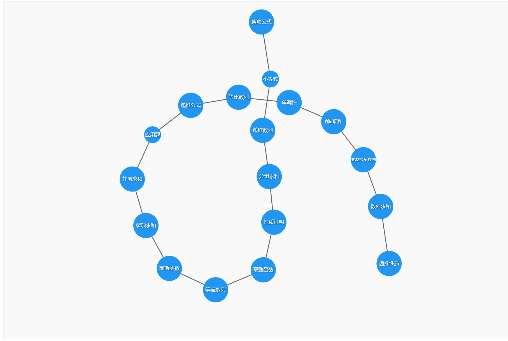

# 基于PyQT的数列学习辅助程序{ignore=true}

**[摘要]**


**[关键词]**

数列, 分类, 学习辅助, PyQt

***

<center>目录</center>
[TOC]

***  

## 1.引言
### 1.1 课题由来
&emsp;&emsp;数列作为高中数学的核心内容之一，是《普通高中数学课程标准》规定的必修模块，在高考数学卷中占据约10%的分值比重。其重要性不仅体现在应试层面，更在于培养学生建立递推思维、函数建模能力和数形结合意识的关键作用。在高中的数学学习过程中, 数列的相关知识种类繁多, 而知识点之间的相关度较低。学习中需要更多的训练才能以较好的程度掌握。而在学习过程中, 传统课堂受限于二维板书呈现方式，学生难以直观感知数列项数变化时的动态规律。同时学习资源之间互相独立, 难以形成合适的学习曲线。
&emsp;&emsp;本研究旨在开发基于PyQT框架的数列学习辅助程序, 提供自动绘制数列图像, 自动对题目分类整理等功能, 填补现有教学工具在自适应学习中的空白。
### 1.2文献综述
&emsp;&emsp;经过对当前存在的辅助学习相关软件进行调研, 可以得知当前的学习辅助软件一类以视频教学为主, 例如空中课堂。另一部分如作业帮, 菁优网等缺少对题目的整理和难度排序, 不适合初学者进行自学。
&emsp;&emsp;同时, 已经存在的辅助学习软件往往拥有自身的题库, 或者是对历年试卷的收集整理。例如作业帮等平台拥有大量题目数据, 
### 1.3研究创新性
&emsp;&emsp; 1. 本研究旨在通过自行定制化的题库, 合并在不同练习册或软件中的题目, 达成一站式无需切换的效果。同时定制化的题库也有利于控制练习范围, 进行强化训练。
&emsp;&emsp; 2. 通过人工智能的自动标注技术, 减少用户的劳动量。并基于标签自动对题目进行分类整理, 构建学习曲线。
&emsp;&emsp; 3. 以网状形式展示题目之间的联系, 有利于用户进行知识点梳理等工作, 优化学习模式。
&emsp;&emsp; 4. 结合数列计算器等实用工具, 优化用户使用体验, 减少切换次数。

## 2.研究方法
### 2.1提出方案
&emsp;&emsp;本课题设计目标为通过设计一款软件, 使其解决一般学生在数列学习方面遇到的一些困难。主要聚焦于练习题目分散, 相关性低, 没有形成合适的学习顺序。同时加入优化做题体验的个性功能, 辅助用户进行练习。
&emsp;&emsp;经过研究，针对设计目标提出课题核心方案：
&emsp;&emsp;1. 辅助学习顺序设计
&emsp;&emsp;通过对题目进行自动归类, 排序, 形成较优的做题顺序。具体化为根据类型, 难度两个因素进行排序, 主要原则为类型逐渐过渡, 难度由易到难。同时记录练习情况, 便于用户自行总结学习效果。
&emsp;&emsp;2. 对题目进行自动分类
&emsp;&emsp;通过训练人工智能模型, 达成输入题面自动输出题目类型与预估难度的功能。能够为用户构建自动化的管理体系, 辅助形成分类练习集, 提升学习效果, 并为用户题目录入提供支持。
&emsp;&emsp;3. 用户自定义题目录入
&emsp;&emsp;为了打破题目在大量练习集的分散情况, 用户可以将自己的题目录入到程序当中, 形成自定义题目集。弥补软件自带题目集不足的缺陷, 提升用户使用效果。
### 2.2软件功能设计
&emsp;&emsp;根据前文2.1所描述的方案, 设计软件具体功能, 软件的具体功能如下所示。
<table style="border-left: none;border-right: none;">
<tr>
    <td rowspan="3" style="border-left: none;border-right: none;" >用户菜单页面</td>
    <td style="border-left: none;border-right: none;" >查看并打开题目</td>
</tr>
<tr>
    <td style="border-left: none;border-right: none;" >查看题目集与题目间关联</td>
</tr>
<tr>
    <td style="border-left: none;border-right: none;" >图示题目间关系</td>
</tr>
<tr>
    <td rowspan="4"style="border-left: none;border-right: none;" >题目练习页面</td>
    <td style="border-left: none;border-right: none;" >显示根据此题的其他推荐题目</td>
</tr>
<tr>
    <td style="border-left: none;border-right: none;" >显示题目标签, 难度等信息</td>
</tr>
<tr>
    <td style="border-left: none;border-right: none;" >渲染题目内容</td>
</tr>
<tr>
    <td style="border-left: none;border-right: none;" >输入题目答案, 并判断正确与否</td>
</tr>
<tr>
    <td  rowspan="4" style="border-left: none;border-right: none;" >数列计算器</td>
    <td style="border-left: none;border-right: none;" >接受算式输入</td>
</tr>
<tr>
    <td style="border-left: none;border-right: none;" >指定通项公式或者递推式</td>
</tr>
<tr>
    <td style="border-left: none;border-right: none;" >指定数列初始项</td>
</tr>
<tr>
    <td style="border-left: none;border-right: none;" >在屏幕上绘制数列</td>
</tr>
<tr>
    <td rowspan="3" style="border-left: none;border-right: none;" >题目自动分类</td>
    <td style="border-left: none;border-right: none;" >接受tex题面与类型输入</td>
</tr>
<tr>
    <td style="border-left: none;border-right: none;" >完成模型训练并能将其导出</td>
</tr>
<tr>
    <td style="border-left: none;border-right: none;" >接受新的题面并自动输出类型</td>
</tr>
</table>  

### 2.3技术路线
&emsp;&emsp;软件部分, 使用`PyQT`作为整体框架, 并结合使用`Qtdesigner`设计软件界面样式, 完成数列计算器, 用户菜单和题目练习页面的布局设计。使用`matplotlib`完成数列绘图相关工作。在其他用户场景通过使用`QwebEngineWeights`渲染`HTML`文本, 使其支持更加丰富的表现体验。并同时借助`HTML`完成对`markdown`, `tex`等其他表现形式的支持。
### 2.4实现途径
&emsp;&emsp;该课题通过如下方式完成此程序的设计与测试


## 3.方案实现
### 3.1题目数据集实现
#### 3.1.1题目储存单元
&emsp;&emsp;通过以下方式储存每一道题目, 并汇聚为数据集。  
```json
{
    "problem_id": "题目编号",
    "question": [
        "题面"
    ],
    "options": [
      "选项"
    ],
    "answer": "答案",
    "analysis": "解析",
    "tags": ["标签"],
    "difficulty": "难度"
  },
```
&emsp;&emsp;1. 程序运行时, 通过读取和解析json文件, 我们可以获取一道题目的详细相关信息。以离线`json`文件的方式记录题目集, 并在程序运行初始化时将其加载到内存中, 以支持后续的读取`tag`, 绘制目录等工作。
&emsp;&emsp;2. 在具体实现中, 每道题目被储存在一个`Question`对象中。其定义如下:
```python
class Question(object):
    """
    储存一道题目的数据
    """
    surface: str | None
    solution: str | None
    analysis: str | None
    options: list[str]
    tags: list[str]
    difficulty: str
    question_id: int

    def __init__(self, surface: str = "", answer: str | None = None, analysis: str | None = None)
        ...
    def unpack(self) -> tuple[str, list[str], str, str, list[str]]:
        ...
    def load_from_file(self, file_name: str) -> Question:
        ...
    def load_from_json(self, d : dir) -> Question:
        ...
```
&emsp;&emsp;3. 考虑到一定的兼容性, 在初始化中(`__init__`), 题面, 答案, 解析是必须提供的, 通过默认设置为`None`的方法, 使其在正常运行时识别对象是否被正常初始化, 避免发生错误。
&emsp;&emsp;4. 函数`unpack`可以返回显示题面需要的所有元素, 通常在提供参数时使用。其具体实现如下:
```python
def unpack(self):
    return self.surface, self.options, self.answer, self.analysis, self.tags
```
&emsp;&emsp;5. 函数`load_from_file`和`load_from_json`均为加载函数, 提供了从单独的题目文件或者已经反序列化的字典中加载题目信息的功能, 同时在读入时自动识别附加信息(选项, 标签, 难度等), 并自动尝试加载。

#### 3.1.2 题目管理器实现
&emsp;&emsp;1. 题目管理器提供了批量加载大量题目, 提供题目信息, 整理统计信息, 回答情况等功能, 同时拥有单个`Question`元素的所有权。其核心元素如下: 
```python
class QuestionsManager(object):
    questions_dir : dict[int, tuple[bool, Question]]
```
&emsp;&emsp;其中`bool`类的值代表了该题的回答正确情况, `Question`的值为`id`对应的题目
&emsp;&emsp;2. 对于基本容器, `QuestionManager`配有标准的增删查改操作支持, 通过重载Python约定的调用函数`__getitem__`, `__setitem__`和`__contains__`, 管理器对象支持`[]`取出对象, `in`关键字查询。
&emsp;&emsp;3. 在实际使用中, `[]`取出元素需要有两种返回方式, 其一为根据`id`返回题目对象的副本, 并根据约定只读使用。其二是根据输入的题目对象返回其回答情况, 因为`Python`不支持函数多态, 所以使用了`isinstance`进行参数类型检查。其具体设计如下:
```python
def __getitem__(self, question_id : Question | int):
    if isinstance(question_id, int):# <- 类型检查 : 如果输入的是题目编号
        if question_id in self.questions_dir.keys():# <- 检查该编号是否存在
            return self.questions_dir[question_id][1] # <- 根据序号约定返回问题对象
        else:
            return Question()# <- 返回未正确初始化的对象阻止接下来的操作
    elif isinstance(question_id, Question): # <- 类型检查 : 如果输入的是题目对象
        if question_id.question_id in self.questions_dir.keys():
            return self.questions_dir[question_id.question_id][0] # <- 根据序号约定返回回答情况
        else:
            return False # <- 对于未知的题目默认返回False
```
&emsp;&emsp;4. 同时, 管理器中的题目对象只能由初始化后固定, 不支持二次修改。根据此原则, `__setitem__`只接受一个`bool`型参数用于对作答情况的修改, 而不能修改该编号对应的`Question`对象本身, 避免编号对应关系发生改变。
### 3.2用户软件界面制作
#### 3.2.1顶级用户界面
##### 3.2.1.1顶级用户界面设计
&emsp;&emsp;顶层用户界面会在程序开始运行时默认打开, 并起到菜单作用。
&emsp;&emsp;1. 用户运行程序后, 会自动打开主菜单, 并同时识别加载题目的所有标签连接成一条链。同时根据自动力传导排版。
&emsp;&emsp;2. 用户可以点击标签节点, 将打开二级题目选择页面。选取每道题目的最多前五个字作为标识符, 同时提供一个特殊节点`exit`, 可以返回标题目录。
&emsp;&emsp;3. 用户点击题目节点, 可以打开题目练习界面, 同时目录页面不会关闭, 支持题目多开等操作。
&emsp;&emsp;4. 用户可以拖动节点排列, 同时每次进入页面都会改变节点布局


<center>图3.1 主菜单页面, `递推数列`分类下的目录</center>

##### 3.2.1.2顶级用户界面实现
&emsp;&emsp;1 前后端通信
&emsp;&emsp;1.1 `PyQt6`提供了信号槽机制来允许`python`与`JavaScript`代码之间传输数据。通过`pyqtSignal`注册信号槽, 并使用`emit`发送数据, 并在`JavaScript`端通过`connect`连接`js`方法, 结合`@pyqtSlot`装饰器完成类型标注, 实现`js`触发`python`的函数并向其发送参数。
&emsp;&emsp;而在`JavaScript`端引入`qrc:///qtwebchannel/qwebchannel.js`同时在`python`端创建`QWebChannal`对象, 完成绑定即可由`python`向`js`端发送数据。
&emsp;&emsp;1.2 在具体实现中, 使用信号槽绑定了用于点击处理, 拖动处理两个函数。使用`channel`向网页端发送节点的名称, 位置等信息。 
&emsp;&emsp;注册信号槽:
```python
class NodeData(QObject):
    updateGraph = pyqtSignal(str)
    positionChanged = pyqtSignal(str)
```
&emsp;&emsp;2. 显示链表/图表
&emsp;&emsp;2.1 每个node即时使用, 即时释放。每次从`QuestionManager`获取数据, 储存指向题目的`id`信息, 自身的显示名字以及自身坐标, 以字典键值对的方式表示。每次重新绘图时清空`Python`端的`node_list`数组并重新生成, 在传递给前端`JavaScript`脚本后生命周期结束。
&emsp;&emsp;用于注册`node`的函数:
```python
def add_node(self, name : str, tag : str):
    self.nodes.append({"id" : f"id_{tag}", "tag" : tag, "name" : name, "x": 600, "y": 400})
    self.node_names.append(name)
```
&emsp;&emsp;同时, 需要将单独的点连成一条链, 在具体实现中表现为操作字典注册对象, 具体实现如下:  
```python  
def add_link(self, a : str, b : str):
    self.links.append({"source": f"id_{a}", "target": f"id_{b}"})
```
&emsp;&emsp;注意到在加入节点时同时维护了一个`node_name`列表, 其作用为记录已经添加的节点, 防止重复添加引发混乱, 以其支持查询函数`has_added`, 实现如下:
```python
def has_added(self, name : str):
    return name in self.node_names
```
&emsp;&emsp;并补充清空函数, 防止所有权混乱, 其实现如下:
```python
def clear(self):
    self.nodes.clear()
    self.node_names.clear()
    self.links.clear()
```
&emsp;&emsp;就此, `nodeData`类提供了增删查操作, 而改在实际使用中并无必要, 满足容器的基本性质
&emsp;&emsp;2.3 为了减少对节点排布的工作量, 使用`QwebEngineWeights` 结合`HTML`中的`D3.js`, 自动创建动态并且可交互的图像, 同时使用`Qchannal`实现软件内的前后端通信, 传递节点和连线信息。
&emsp;&emsp;在实际执行中, 先由`python`后端筛选, 注册节点与连接关系, 将数据通过`channel`传递给`webengine`内, 同时通过编写`html`与`javascript`相关代码绘制节点与连线。同时使用`d3.js`对力矩修改实现有限的拖拽效果。
&emsp;&emsp;2.4 在实际的实现中, 由于浏览器执行的异步性, 有时会出现在`d3.js`和`Qwebchannal`初始化完成之前就开始尝试加载绘制代码。这会使得浏览器核心崩溃, 无法正确显示图像。为了结局相关问题, 在`JavaScript`代码中加入了相关判断逻辑, 识别当前的初始化阶段和初始化情况, 避免在初始化完成前执行浏览器主逻辑。   
&emsp;&emsp;初始化入口: 
```javascript
// D3可用性检查
document.addEventListener('DOMContentLoaded', () => {
    if(typeof d3 !== 'undefined') {
        isD3Ready = true;
    } else {
        console.error('D3.js加载失败');
    }
});

// Qt WebChannel初始化
new QWebChannel(qt.webChannelTransport, (channel) => {
    console.log('WebChannel初始化完成', channel.objects);
    window.nodeData = channel.objects.nodeData;
    console.log('nodeData对象可用性', typeof window.nodeData.updateGraph);
    webChannelLoaded = true;
    checkInit();
});


if (typeof d3 !== 'undefined') {
    console.log('D3.js已加载');
    d3Loaded = true;
    checkInit();
} else {
    console.error('D3.js未加载！');
}
function checkInit() {
    console.log('检查初始化状态，webChannelLoaded:', webChannelLoaded, 'd3Loaded:', d3Loaded);
    if (webChannelLoaded && d3Loaded) {
        console.log('全部依赖加载完成，开始初始化');
        realInitialize();
    }
}

// 统一初始化入口
function realInitialize() {
...
}
```
&emsp;&emsp;2.4 同时, `QWebEngineWeights`继承自`QWeights`, 并需要在重载(reload)后才能重新适应窗口大小。为了解决重载操作会销毁网页部分的`channel`导致断开链接的问题, 设计了在前端的`loadFinished`触发时重新加载的功能, 通过reload操作触发前端的`loadFinished`信号, 进而进行重初始化, 避免`channel`被销毁导致出现悬空指针。

&emsp;&emsp;3. 处理对节点的点击与识别
&emsp;&emsp;3.1 `node`一共有三种用法, 其效果分别是打开下一层目录, 返回根目录, 打开题目。为了能够识别每个`node`承担的功能, 使用了操作符的设计。每个`node`的`tag`具有层级结构, 由`::`分割。其中打开次级目录的`tag`为`menu::名称`, 而负责回到主页面的`tag`为`exit::...`, 均不匹配的则会被识别为题目名称。
&emsp;&emsp;关于`tag`识别的代码实现:
```python
@pyqtSlot(str)
def handleNodeClick(self, tag : str):
    logger.debug(f"Node clicked! Tag: {tag}")
    opt = tag.split("::")
    if opt[0] == 'menu':
        self.clear()
        self.upper.add_one_tag(opt[1])
    elif opt[0] == "exit":
        self.clear()
        self.upper.send_initial_data()
    else:
        new_window = question_show.HomeWindow(self.upper, tag)
        new_window.show()

    self.refresh_graph()
```
&emsp;&emsp;4. 获取显示内容
&emsp;&emsp;4.1 显示时, 需要先提取所有的`tag`, 形成目录, 对于单个被选中的`tag`, 需要再次处理出所有含有该`tag`的题目。在具体实现中依赖于`nodeData`提供的相关接口
&emsp;&emsp;提取所有`tag`并注册, 连线
```python
self.node_data.clear()
all_tags = set()
for _, each_ques in self.question_lib.questions_dir.values():
    for tag in each_ques.tags:
        all_tags.add(tag)

tag0 = None
for tag in all_tags:
    self.node_data.add_node(tag, f"menu::{tag}")
    if tag0 is not None:
        self.node_data.add_link(f"menu::{tag0}", f"menu::{tag}")
    tag0 = tag
```
&emsp;&emsp;在取出含有特定`tag`的题目时, 通过使用列表推导式快速取出所有符合要求的题目来加速运行。列表推导式是 Python 中用于创建列表的一种简洁而优雅的方法。通过列表推导式，可以从一个或多个可迭代对象（如列表、元组、字符串、集合等）中生成一个新的列表，同时可以在生成过程中对元素进行过滤和转换。列表推导式不仅能使代码更加简洁，还能提升可读性和执行效率。在实现中除了提取题目, 还将其以难度为关键字排序, 以形成合适的学习曲线, 其具体实现如下:
```python
def add_one_tag(self, tag : str):
    same_tag_list = [q for _, q in self.question_lib.questions_dir.values() if tag in q.tags]
    same_tag_list.sort(key=lambda x: {"简单": 1, "中等": 2, "困难": 3, "空": 4}[x.difficulty])

    q1 = Questions.Question()
    q1.question_id = "exit"
    q1.surface = "exit                 "
    for q in same_tag_list:
        self.node_data.add_node(q1.surface[0:min(len(q1.surface), 5)], q1.question_id)
        self.node_data.add_link(q1.question_id, q.question_id)
        q1 = q
    self.node_data.add_node(q1.surface[0:min(len(q1.surface), 5)], q1.question_id)
```

#### 3.2.2题目练习页面
##### 3.2.2.1题目练习页面设计
&emsp;&emsp;题目练习页面会在目录选择了题目后被调出, 负责相关操作。
&emsp;&emsp;1. 题目练习页面需要其能够支持`markdown`和$\TeX$语法, 显示题面相关信息。并同时显示选项等相关内容。
&emsp;&emsp;2. 用户可以在该页面内提交题目答案并核对, 检查用户作答正确性。
&emsp;&emsp;3. 可以根据用户当前正在作答的题目进行其他题目推荐, 并显示在侧边栏中, 允许用户快捷跳转至该题目
&emsp;&emsp;4. 在侧边栏可以显示题目难度, 标签等相关信息。

<center>图3.2.1 答题页面</center>

##### 3.2.2.2题目练习页面实现
&emsp;&emsp;1. 题目练习页面中的题目渲染同样使用了`QWebEngineWeights`, 以更加方便的支持`markdown`和 $\TeX $。使用了`python`的`markdown`库来将`markdown`格式的文本处理成`html`格式, 再在其中引用`mathjax`的`js`文件进行$\TeX$格式的处理, 最终将两部分结合渲染。
&emsp;&emsp;2. 右侧栏目的实现同样为浏览器内核, 而题目跳转的部分同样使用了前后端通信的信号槽, 由于在此处处理的信息多为文本, 则创建了`Bridge`负责直接生成相应的`html`格式文本, 省去`Qchannel`的多余加载代码和开销。
&emsp;&emsp;`Bridge`类实际上为`html`生成代理, 通过约定接口共享函数和`QWebEngineWeights`实例的所有权。在每次刷新页面时通过`replace`文本替换调整显示内容。
&emsp;&emsp;`Bridge`同时负责启动前端页面渲染和内容替换, 为了方便从`json`文件直接打开题目内容, 加载题目的方法同样支持两种输入, 数字输入即识别为id, 文本输入即识别为文件地址。而前端的`tag`信息传递中只能选择`str`类型的信号槽, 因此在实际收到`tag`先尝试将其转化为数字, 如果在此过程中打开题目抛出异常, 则将其作为文件地址处理。
&emsp;&emsp;`Bridge`生成实现细节:
```python
@pyqtSlot(str) # <- 注册前端信号槽
def handle_tag(self, tag):
    logger.debug(f"Received tag: {tag}")

    assert self.view is not None                # 此处为约定的调用接口检查
    assert callable(self.main_question_connect) #
    assert callable(self.get_tag)               #
    tags = []
    try:
        self.main_question_connect(int(tag))    # id
        tags = " ".join(self.get_tag(int(tag))) #
    except ValueError as e:                     # 支持两种打开方式
        self.main_question_connect(tag)         # 文件名
        tags = " ".join(self.get_tag(tag))      #

    self.view.setHtml(self.base_html
                        .replace("[replaced-site1]", self.question_list[1][0])
                        .replace("[replaced-site2]", self.question_list[2][0])
                        .replace("[replaced-site3]", self.question_list[3][0])
                        .replace("[replaced-site4]", self.question_list[4][0])
                        .replace("[replaced-site5]", self.question_list[5][0])
                        .replace("[replaced-site1-title]", self.question_list[1][1])
                        .replace("[replaced-site2-title]", self.question_list[2][1])
                        .replace("[replaced-site3-title]", self.question_list[3][1])
                        .replace("[replaced-site4-title]", self.question_list[4][1])
                        .replace("[replaced-site5-title]", self.question_list[5][1])
                        .replace("[replaced-tags]", tags)
                        ) # <- 为了实现方便牺牲了一部分可扩展性
```
&emsp;&emsp;其中的`main_question_connect`和`get_tag`均为由主窗口传递的函数接口, 在使用前进行检查防止错误的初始化导致异常。例如`main_question_connect`实际绑定至主程序中的`load_question`。
&emsp;&emsp;3. 在加载题目时需要同时生成题目推荐, 在实际编写中则为查找含有相同题目类型的题目并输出, 使用列表推导式进一步提高效率, 其详细实现如下:
```python
same_tag_list : list[Questions.Question] = [] # 类型标记以触发自动补全
same_tag_list += [q for _, q in self.question_lib.questions_dir.values() if tag in q.tags and q.question_id != question_input.question_id]
#                 ^     ^^^^                                    ^         ^^^^^^^^^^^^^^^^^^^^^^^^^^^^^^^^^^^^^^^^^^^^^^^^^^^^^^^^^^^^^^^^^
#                 |     解包操作, 提取Question对象               |                                   均为条件表达式, 含有相同tag但不是同一题
#                 实际操作对象                                  获取所有的值, 相当于取出所有Question
```
&emsp;&emsp;由此取出所有符合要求的题目, 再将其填入填充队列中, 完成替换。
&emsp;&emsp;4. 当用户点击提交按钮, 软件会将输入框的内容与储存的答案进行比对, 并返回是否回答正确:

<center>图3.2.2 回答正确的反馈</center>  

&emsp;&emsp;5.在题面上方工具栏中提供了一定的辅助功能, 其中打开计算器可以打开数列计算器, 提供学习辅助, 其他功能包含关闭右侧栏和从文件加载问题, 关闭右侧栏可以提供更加专注的思考环境, 从文件加载题目则提供了自定义题目支持。

<center>图3.2.3 顶部工具栏</center>


#### 3.2.3数列计算器实现
##### 3.2.3.1数列计算器设计
&emsp;&emsp;1. 计算器需要接受用户输入, 并计算出其若干个点呈现在屏幕上。同时应该支持通项公式和递推式两种输入格式。
&emsp;&emsp;2. 计算器支持指定计算的项数和初始项的值, 为递推式提供一定支持。
&emsp;&emsp;3. 计算器表现形式需要足够直观, 因此选择了图像的方式来展现计算完成的数列。
&emsp;&emsp;4. 图像的方式展示会丢失一部分精准度, 同时需要支持从图像中获取准确数值。

<center>图3.2.4 计算器页面</center>

##### 3.2.3.2数列计算器实现。
&emsp;&emsp;1. 为了图像的表现形式, 使用了与`pyqt`相互兼容的`matplotlib`提供支持, 并且通过`matplotlib.pyplot`直接在程序页面上绘制图像, 接受鼠标信息, 减免了大量的浏览器操作, 同时去除了浏览器依赖, 使其能够单独使用。
&emsp;&emsp;设置`matplotlib`使其与`pyqt`模式相兼容。
```python
matplotlib.use("QtAgg")
from matplotlib.backends.backend_qtagg import FigureCanvasQTAgg as FigureCanvas
```
&emsp;&emsp;通过继承`matplotlib`提供的类, 能够以对待一般控件的方式将其添加到`pyqt`产生的窗口中, 而同样能与对待`pyplot`的方式对其进行设置, 为代码的编写提供了大量便利。
&emsp;&emsp;绘图控件的一部分初始化, 包含了生成默认数组, 图像, 设置标题和抬头等内容:
```python
class MplCanvas(FigureCanvas):
    def __init__(self, parent=None):
        fig, self.ax = plt.subplots()
        super().__init__(fig)
        self.x = numpy.arange(0, 10, 1)
        self.y = 2 * self.x + 1
        self.ax.scatter(self.x, self.y, label='2x + 1')
        self.ax.set_title('Matplotlib in PyQt6')
        self.ax.set_xlabel('n')
        self.ax.set_ylabel('a[n]')
        self.ax.legend()
```
&emsp;&emsp;2. 计算器需要能够以给出的公式更新图像, 而对待通项公式和递推式需要两种方式处理, 其均使用了`python`提供的`eval`函数解析表达式, 通过约定特定的全局变量来提供递推支持。约定$n$为项数或自变量, $a[]$为储存了已计算数值的数组。其关键在于维护键值对字典$a$, 将计算的值储存在字典中, 同时字典也作为参数提供给表达式进行计算, 达到访问前项值的效果, 其关键实现如下:
&emsp;&emsp;对于通项公式: 
```python
for k in range(n):
    context = {
        'n': k,
        'math': math
    }
    try:
        current = eval(expr, context, math.__dict__)
        a.append(current)
    except Exception as e:
        logger.error(f"计算通项时出错：{e}")
```
&emsp;&emsp;对于递推式, 则增加了处理初始项的代码
```python
initial = set_dir['init_number']
a = initial.copy()
current_length = len(initial)
if n <= current_length:
    return numpy.array(a[:n])
for k in range(current_length, n):
    context = {
        'a': a,
        'n': k,
        'math': math
    }
    try:
        current = eval(expr, context, math.__dict__)
        a.append(current)
    except IndexError as e:
        logger.error(f"初始项设置错误 : {e}")
    except Exception as e:
        logger.error(f"计算递推式时出错：{e}")
```
&emsp;&emsp;3. 可以通过设置来改变计算的项数与初始项, 设置页面由一个单独的页面组成。其中可以自定义修改相关内容, 在关闭时可以自动保存, 避免忘记保存导致没有改变等情况发生。此处可以修改给出的式子类型, 初始项与计算项数。同时在程序运行中使用一个字典来保存设置内容, 在需要调取时取出, 实际为字典对象`set_dir`。

<center>图3.2.5 设置</center>   

&emsp;&emsp;关于设置的代码实现如下:   
```python
def change_mode(self):
    now_mode_idx = (set_dir["possible_mode"].index(set_dir["mode"]) + 1) % len(set_dir["possible_mode"])
    set_dir["mode"] = set_dir["possible_mode"][now_mode_idx]
    self.mode_Button.setText({1: "递推式", 2: "通项公式"}[set_dir["mode"]])

def update_setting(self):
    try:
        set_dir["init_number"] = list(map(float, self.init_input.text().split(" ")))
    except Exception as e:
        logger.error(f"初始化初始项数组 : {e}")
    try:
        set_dir["max_index"] = max(int(self.max_number_input.text()), 10)
    except Exception as e:
            logger.error(f"最大项数设置出错 : {e}")
```
&emsp;&emsp;4. 通过注册`matplotlib`的鼠标移动事件, 能够支持图像显示特定点的具体数值。在具体运行中, 会选择当前距离鼠标最近的一个节点, 将其的数值显示出来。其使用了继承类中的`mpl_connect`绑定鼠标移动, 并使用`annot`来指定显示类型。

<center>图3.2.6 指示器效果</center>

&emsp;&emsp;其在代码中的注册与实现如下:
```python
#注册
self.annot = self.ax.annotate("", xy=(0, 0), xytext=(20, 20),
                                textcoords="offset points",
                                bbox=dict(boxstyle="round", fc="w"),
                                arrowprops=dict(arrowstyle="->"))
self.annot.set_visible(False)

# 连接鼠标移动事件
self.mpl_connect("motion_notify_event", self.hover)

#实现
def hover(self, event):
    if event.inaxes == self.ax:
        # 获取鼠标位置
        x, y = event.xdata, event.ydata
        # 查找最近的点
        if x is not None and y is not None:
            index = (numpy.abs(self.x - x)).argmin()
            self.annot.xy = (self.x[index], self.y[index])
            self.annot.set_text(f'n : {self.x[index]}\na[n] : {self.y[index]}')
            self.annot.set_visible(True)
            self.draw()
    else:
        self.annot.set_visible(False)
        self.draw()
```
&emsp;&emsp;

### 3.3 自动分类系统
#### 3.3.1分类系统设计
&emsp;&emsp;1. 分类系统应当接受`markdown` + $\TeX$结合的输入, 并输出题目的具体类型, 难度, 帮助构建带有类型, 难度等参数的题库, 支持用户界面系统的扩展和运行
&emsp;&emsp;2. 分类系统应当在训练完后一并打包在程序中, 使得其动态接受输入并输出, 而不是反复重新训练。
&emsp;&emsp;3. 选择`BERT`模型进行训练, 其在相关应用中表现良好, 在11项NLP任务中刷新SOTA记录, 适应自然文本分类问题。
&emsp;&emsp;bert流程图
```
graph TD
    A[输入文本] --> B(分词器 Tokenizer)
    B --> C[[Token Embeddings]]
    C --> D[+Position Embeddings]
    D --> E[+Segment Embeddings]
    E --> F[Transformer Encoder x 12/24层]
    F --> G[任务特定输出]
```
#### 3.3.2分类系统实现
&emsp;&emsp;1. 图片识别无法完成公式提取的工作, 经过大量实验, 验证了
&emsp;&emsp;2. 因为无法寻找到符合要求的数据集, 本项目中所使用的数据为人工结合`deepseek`辅助构建, 同时数量过少无法支撑起有效的模型训练要求, 因此代码实现只能根据设计编写。
&emsp;&emsp;3. 分类之前, 需要构建标签表与数据集, 通过`MultiLabelBinarizer`将标签二值化, 并拟合相似标签, 以支持后一步训练。

## 4 分析与讨论
&emsp;&emsp;课题通过结合自身感受与查阅资料, 分析了在当前数列学习中遇到的一定困难, 包括教学仓促, 缺少系统化, 定制化的练习, 在实际做题时缺少有力的帮助工具。
&emsp;&emsp;同时正常教育中节奏偏快, 对于学习曲线的构建通常较为陡峭。本项目通过适当安排难度和类型, 试图为用户构建一个更好的学习曲线。
&emsp;&emsp;本课题中大量使用`QWebEngineWeights`, 从技术角度分析, 其为实现带来了诸多方便, 但是同时引入了浏览器内核, 导致最终打包文件变得臃肿。
&emsp;&emsp;该课题能够为数列学习提供一定的辅助工作, 但是仍然存在一定缺陷。

## 总结与展望
&emsp;&emsp;**课题总结:**
&emsp;&emsp;课题为提高在数列学习中的学习速度与学习效果, 优化学生的练习过程, 减少无意义的刷题训练。通过软件程序的方式提供了一套帮助工具。填补了自主自学工具方面存在的空白, 能够提升自主练习的体验, 提升自学效果。
&emsp;&emsp;**课题前景展望:**
&emsp;&emsp;该课题在实现过程中初步具备设计上的功能, 